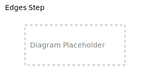

# Edges Step

The `edges` step traverses from vertices to their connecting edges, allowing navigation along relationships in the
graph. This step shifts the walker's position from vertices to their adjacent edges.

<object data="images/edges.svg" type="image/svg+xml">
    
</object>

## Syntax

```rust,noplayground
walker.edges(search_criteria)
```

Where `search_criteria` is an `EdgeSearch` object or a predefined search from an index.

## Parameters

- `search_criteria`: An `EdgeSearch` object that defines criteria for selecting edges, including:
    - Edge labels
    - Direction (incoming, outgoing, or both)
    - Property values (when supported)

## Return Value

Returns a new walker positioned at the edges matching the search criteria.

## Examples

### Finding All Connected Edges

Get all edges connected to a vertex:

```rust,noplayground
{{#include edges/edges_examples.rs:all_edges}}
```

### Directional Edge Queries

Specify whether you want incoming or outgoing edges:

```rust,noplayground
{{#include edges/edges_examples.rs:directional}}
```

### Label-Based Edge Filtering

Filter edges by their label:

```rust,noplayground
{{#include edges/edges_examples.rs:label_filter}}
```

### Combined Filtering

Combine direction and label filtering:

```rust,noplayground
{{#include edges/edges_examples.rs:combined_filter}}
```

## Best Practices

- Specify the direction when possible to limit the search space
- Use label-based indexes to avoid scanning all edges
- Follow edges step with head() or tail() to continue vertex-based traversals
- Consider the naming of relationships to match conceptual understanding

## Common Use Cases

- **Relationship navigation**: Moving from vertices to their connections
- **Filtered relationships**: Finding specific types of connections between vertices
- **Direction-specific queries**: Finding incoming or outgoing relationships
- **Relationship property examination**: Inspecting metadata on connections
