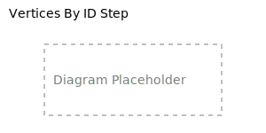

# Vertices By ID Step

The `vertices_by_id` step starts a traversal from a specific set of vertices identified by their IDs. This is typically
the most efficient way to start a traversal when you know exactly which vertices you want.



## Syntax

```rust,noplayground
graph.walk().vertices_by_id(ids)
```

Where `ids` is an iterator yielding vertex IDs.

## Parameters

- `ids`: An iterator yielding vertex IDs to include in the traversal

## Return Value

Returns a new walker positioned at the vertices with the specified IDs.

## Examples

### Basic Usage

Start a traversal with specific vertex IDs:

```rust,noplayground
{{#include vertices_by_id/vertices_by_id_examples.rs:basic_usage}}
```

### Following Relationships

Start from a specific vertex and follow its relationships:

```rust,noplayground
{{#include vertices_by_id/vertices_by_id_examples.rs:followed_by_steps}}
```

### Using Dynamically Collected IDs

Use IDs collected from a previous traversal:

```rust,noplayground
{{#include vertices_by_id/vertices_by_id_examples.rs:dynamic_ids}}
```

## Best Practices

- Prefer `vertices_by_id` over other methods when you already have the exact IDs
- Be aware that invalid IDs are silently skipped rather than causing errors
- Keep track of the original ID order if the order of results matters
- Consider batching large ID collections for better performance in extensive traversals

## Common Use Cases

- **Known entry points**: Starting traversals from specific, known vertices
- **Multi-stage traversals**: Using the results of one traversal as the starting point for another
- **External ID mapping**: Starting from IDs provided by external systems or caches
- **Selective subgraph processing**: Working with a specific subset of vertices identified by ID
